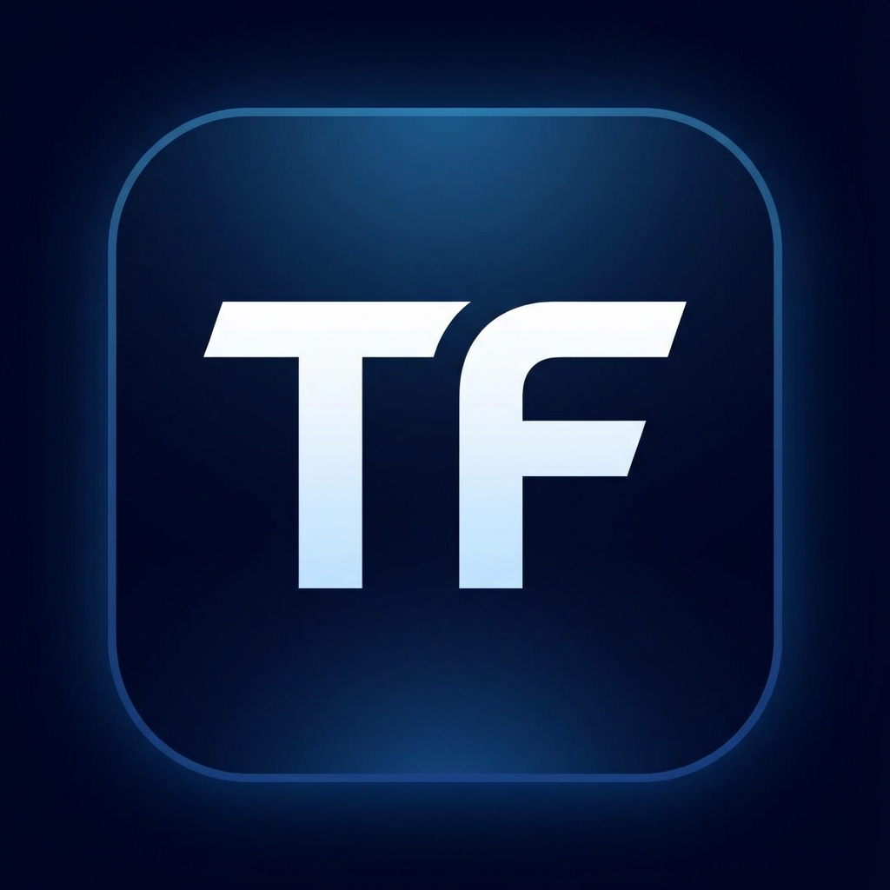

# ThreeFold Grid Agent GUI

A modern, AI-powered desktop application for managing ThreeFold Grid infrastructure. Built with [Wails](https://wails.io/) and Svelte, this GUI provides an intuitive chat interface to interact with the ThreeFold Grid using natural language commands.



## Features

- 🤖 **AI-Powered Chat Interface** - Interact with the Grid using natural language powered by Google Gemini
- 🎨 **Modern UI** - Beautiful, responsive interface with dark/light theme support
- 🔐 **Secure Onboarding** - Easy setup with mnemonic phrase, network selection, and API key configuration
- ⚡ **Real-time Command Execution** - Stream command output in real-time with visual feedback
- 🌐 **Multi-Network Support** - Connect to mainnet, testnet, or devnet
- 🖥️ **Cross-Platform** - Available for Linux, macOS, and Windows

## Prerequisites

- **Go** 1.21 or higher
- **Node.js** 18 or higher
- **Wails CLI** v2.11.0 or higher
- **tfcmd** - ThreeFold Grid CLI tool (installed automatically via Makefile)

### Installing Wails

```bash
go install github.com/wailsapp/wails/v2/cmd/wails@latest
```

## Quick Start

### Installation

The easiest way to install the Grid Agent GUI is using the provided Makefile:

```bash
# Install both tfcmd and grid-agent-gui
make install-grid-agent-with-grid-cli

# Or install just the GUI (requires tfcmd to be installed separately)
make install-grid-agent-gui
```

This will:
- Build the application for your platform
- Install the binary to `~/.local/bin` (Linux) or `/usr/local/bin` (macOS)
- Create a desktop entry with icon (Linux only)
- Set up proper PATH configuration for command execution

### Running the Application

After installation, you can launch the application:

**From Desktop Launcher:**
- Search for "ThreeFold Grid Agent" in your application menu

**From Terminal:**
```bash
grid-agent-gui
```

### First-Time Setup

On first launch, you'll be guided through the onboarding process:

1. **Enter Mnemonic Phrase** - Your ThreeFold Grid account mnemonic (12 or 24 words)
2. **Select Network** - Choose between mainnet, testnet, or devnet
3. **Provide Gemini API Key** - Your Google Gemini API key for AI functionality

Get a free Gemini API key at: https://aistudio.google.com/app/apikey

## Development

### Project Structure

```
grid-agent-gui/
├── app.go                 # Main application logic and Wails bindings
├── main.go               # Application entry point
├── frontend/             # Svelte frontend application
│   ├── src/
│   │   ├── App.svelte   # Main app component
│   │   ├── lib/         # Reusable components
│   │   └── assets/      # Images and static assets
│   └── package.json
├── internal/             # Internal packages
│   ├── config/          # Configuration and prompts
│   └── tfcmd/           # tfcmd integration
└── build/               # Build assets (icons, etc.)
```

### Live Development

Run the application in development mode with hot reload:

```bash
wails dev
```

This starts:
- A Vite development server for the frontend (with hot reload)
- The Go backend
- A dev server at http://localhost:34115 for browser-based development

### Building from Source

**For your current platform:**
```bash
make build-grid-agent-with-grid-cli
```

**For specific platforms:**
```bash
# Linux
make build-grid-agent-gui-linux

# macOS (Intel)
make build-grid-agent-gui-darwin

# macOS (Apple Silicon)
make build-grid-agent-gui-darwin-arm64

# Windows
make build-grid-agent-gui-windows
```

**Build for all platforms:**
```bash
make build-grid-agent-with-grid-cli-all-platforms
```

Binaries will be output to `build/grid-agent/<os>-<arch>/`

### Frontend Development

The frontend is built with Svelte and TypeScript. To work on the frontend:

```bash
cd frontend
npm install
npm run dev
```

## Architecture

### Backend (Go)

- **Wails Framework** - Provides the bridge between Go and the frontend
- **Agent Core** - AI agent logic from `agent/pkg/core`
- **LLM Integration** - Google Gemini API integration via `agent/pkg/llm`
- **Tool System** - Extensible tool system for command execution and URL fetching
- **tfcmd Integration** - Dynamic schema generation from tfcmd commands

### Frontend (Svelte)

- **Svelte 4** - Reactive UI framework
- **TypeScript** - Type-safe development
- **Vite** - Fast build tool and dev server
- **Wails Runtime** - Communication with Go backend

### Communication Flow

```
User Input → Frontend (Svelte)
    ↓
Wails Runtime Bridge
    ↓
Go Backend (app.go)
    ↓
Agent Core + LLM Provider
    ↓
Tool Execution (tfcmd, system commands)
    ↓
Real-time Streaming ← Event Emission
    ↓
Frontend Updates (via Wails Events)
```

## Configuration

Settings are stored in `~/.config/grid-agent/settings.json`:

```json
{
  "mnemonics": "your mnemonic phrase",
  "network": "mainnet",
  "geminiApiKey": "your-api-key",
  "theme": "dark",
  "isConfigured": true
}
```

### Environment Variables

- `GEMINI_API_KEY` - Set automatically from settings
- `PATH` - Extended to include `~/.local/bin` for tfcmd access

## Troubleshooting

### Command Output Not Streaming in Real-time

If you're launching from a desktop shortcut and commands don't stream output in real-time, it is likely a buffer issue and a fix is WIP. Running the application from the terminal should work:

```bash
grid-agent-gui
```

### tfcmd Not Found

Ensure tfcmd is installed and in your PATH:

```bash
# Install tfcmd
make install-grid-cli

# Verify installation
which tfcmd
tfcmd --version
```

### Icon Not Showing (Linux)

If the application icon doesn't appear in your launcher:

1. Update icon cache:
   ```bash
   gtk-update-icon-cache ~/.local/share/icons/hicolor/ -f
   update-desktop-database ~/.local/share/applications/
   ```

2. Log out and log back in, or restart your desktop environment

## Contributing

Contributions are welcome! Please ensure:

- Code follows Go and TypeScript best practices
- Frontend changes maintain the existing design language
- New features include appropriate error handling
- Commands are properly integrated with the streaming system

## License

This project is part of the [tfgrid-sdk-go](https://github.com/threefoldtech/tfgrid-sdk-go) repository.

## Support

For issues and questions:
- GitHub Issues: https://github.com/threefoldtech/tfgrid-sdk-go/issues
- ThreeFold Forum: https://forum.threefold.io/

## Credits

- **Author**: Sameh Abouel-saad
- **Framework**: [Wails](https://wails.io/)
- **AI Provider**: [Google Gemini](https://ai.google.dev/)
- **ThreeFold**: [threefold.io](https://threefold.io/)
